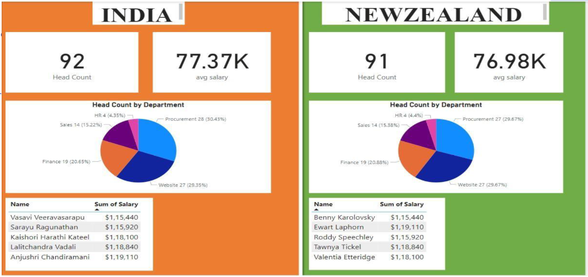

<h1 align="center">Hi, I'm Kambhampati Ranga Sai 👋</h1>

  🚀 <strong>Data Analyst | MCA Student</strong>  

  I turn raw data into meaningful insights using Python, SQL, Excel, Power BI, and Tableau.  
  Passionate about dashboards, analytics, and solving real-world business problems.

---

## 🔗 My Portfolio
🌐 **Live Portfolio:**  
👉 **https://kambhampatirangasai.github.io/KAMBHAMPATIRANGASAI/**

---

## 🔍 About Me
- 🎓 MCA Student at Aurora University (GPA: 8.20)
- 📊 Hands-on experience with HR, EV, and business analytics datasets  
- 🏆 Best Performer in Data Analyst Internship  
- 📈 Skilled in Power BI, Tableau & ML (Logistic Regression)  
- 🤝 Strong teamwork, problem-solving, and communication skills  
- 📍 Hyderabad, Telangana, India – 500039  

---

## 🛠️ Tech Stack

### **Programming & Analytics**
- Python  
- SQL  
- Excel  
- Power BI  
- Tableau  
- Jupyter Notebook  
- Google Colab  
- VS Code

### **Machine Learning**
- Logistic Regression  
- Classification Models  
- Data Cleaning  
- EDA (Exploratory Data Analysis)

---

## 🛠️ Skills & Tools (Badges)

### Programming & Analytics

### Data Visualization

### Development Environments

### Machine Learning

---

## 📂 Featured Projects

### 🔹 **HR Analytics – Predict Employee Attrition**

- Built ML model (Logistic Regression) with 85% accuracy  
- SHAP analysis to explain top attrition reasons  
- Designed Power BI dashboard  
🔗 **GitHub:** *https://github.com/KAMBHAMPATIRANGASAI/Elevate-Labs-Internship-Project-HR-Analytics-Predict_Employee_Attrition*

---

### 🔹 **Electric Vehicle Data Analysis**

- Analyzed U.S. EV registration trends  
- Created Tableau dashboards  
- Studied manufacturers, CAFV eligibility & EV adoption  
🔗 **GitHub:** *https://github.com/KAMBHAMPATIRANGASAI/Electric-Vehicle-Data-Analysis*

---

### 🔹 **HR Data Analysis Dashboard**

- Power BI dashboard for HR performance, salary, and demographics  
- Highlighted retention opportunities and workforce insights        
🔗 **GitHub:** *https://github.com/KAMBHAMPATIRANGASAI/HR-Data-Analysis*

---

## 🏅 Certifications
- Microsoft Certified: Power BI Data Analyst Associate  
- Google Analytics Certification  
- Deloitte Data Analytics Virtual Internship  
- Data Visualization with Power BI & Tableau – Aditya University 
- Data Visualisation: Empowering Business with Effective Insights 

---

## 📊 GitHub Stats

  
  

  

---

## 📫 Connect With Me
📧 Email: **rangasaik06@gmail.com**  
🔗 LinkedIn: **https://linkedin.com/in/ranga-sai-kambhampati-b819b6287**  
💻 GitHub: **https://github.com/KAMBHAMPATIRANGASAI**  
🌐 Portfolio: **https://kambhampatirangasai.github.io/KAMBHAMPATIRANGASAI/**  

---

✨ Thanks for visiting my profile! ✨  
 Feel free to check out my projects and connect with me.

